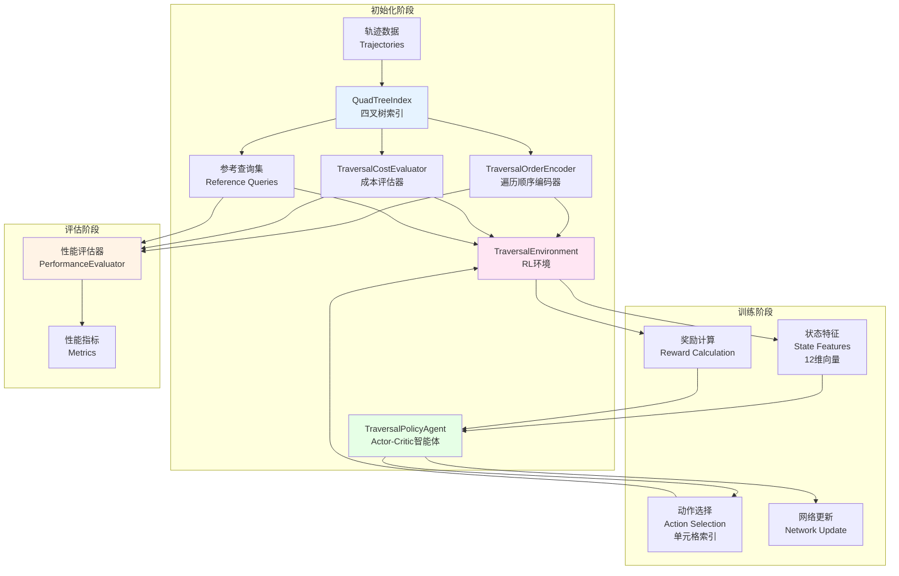
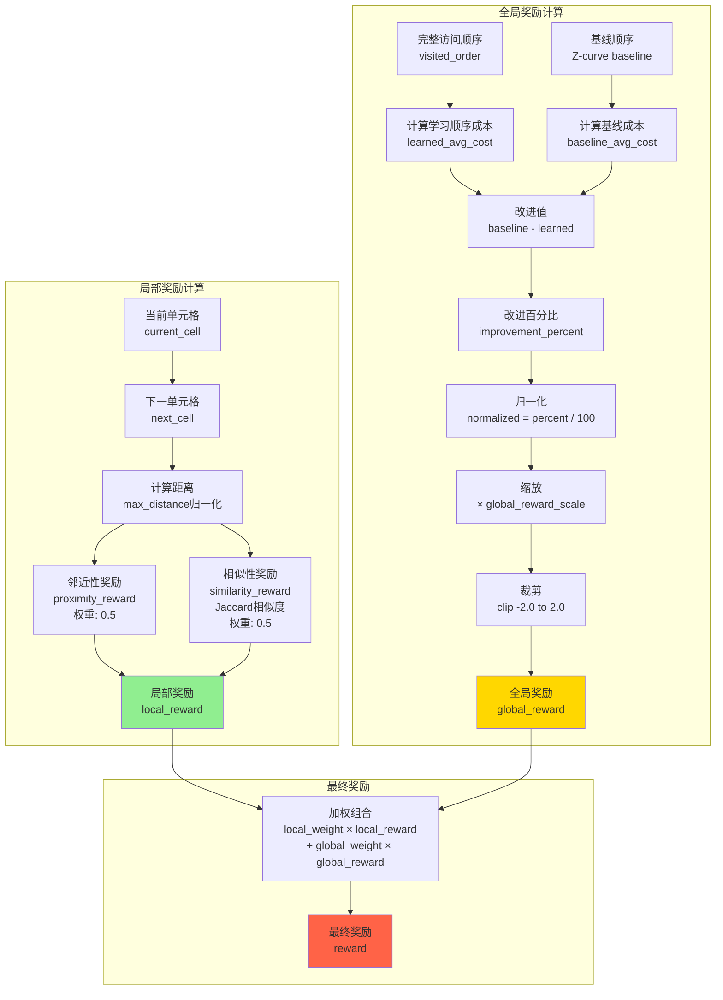
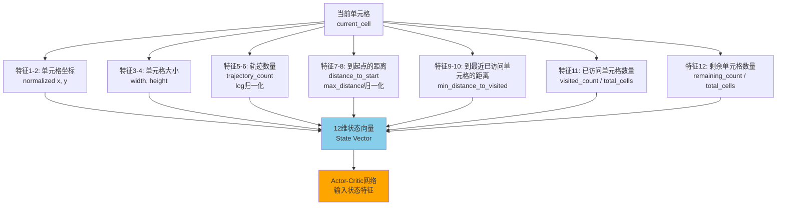
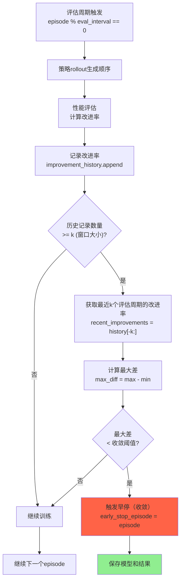

# 自定义遍历顺序训练流程图

本文档使用 Mermaid 流程图展示整个自定义遍历顺序（Learned T-Shape）的训练流程。

## 完整训练流程图

```mermaid
flowchart TD
    Start([开始训练]) --> Init1["创建四叉树<br/>QuadTreeIndex"]
    Init1 --> Init2["加载轨迹数据<br/>TDrive/合成数据"]
    Init2 --> Init3["分配轨迹到四叉树节点<br/>assign_trajectory"]
    Init3 --> Init4{"是否需要剪枝?"}
    Init4 -->|是| Init5["剪枝稀疏节点<br/>prune_and_mark_active_cells"]
    Init4 -->|否| Init6["生成参考查询集<br/>generate_reference_queries"]
    Init5 --> Init6
    Init6 --> Init7["初始化组件<br/>Encoder, CostEvaluator, Environment"]
    Init7 --> Init8["创建RL智能体<br/>TraversalPolicyAgent<br/>Actor-Critic网络"]
    
    Init8 --> TrainLoop["训练循环<br/>for episode in range num_episodes"]
    
    TrainLoop --> EpReset["环境重置<br/>environment.reset"]
    EpReset --> EpState["获取初始状态<br/>state, action_mask"]
    
    EpState --> StepLoop["Episode步进循环<br/>while not done"]
    
    StepLoop --> RefineMask["精炼动作掩码<br/>Top-K相似度过滤"]
    RefineMask --> SelectAction["智能体选择动作<br/>agent.select_action<br/>Actor网络输出"]
    SelectAction --> EnvStep["环境执行动作<br/>environment.step action"]
    
    EnvStep --> CalcLocalReward["计算局部奖励<br/>step_reward<br/>邻近性 + 相似性"]
    CalcLocalReward --> CheckDone{"是否访问完所有节点?"}
    
    CheckDone -->|否| CalcGlobalReward1["全局奖励 = 0"]
    CheckDone -->|是| CalcGlobalReward2["计算全局奖励<br/>baseline_cost - learned_cost<br/>归一化 + 缩放 + 裁剪"]
    
    CalcGlobalReward1 --> CombineReward["组合奖励<br/>local_weight × local_reward<br/>+ global_weight × global_reward"]
    CalcGlobalReward2 --> CombineReward
    
    CombineReward --> StoreTransition["存储经验<br/>agent.store_transition<br/>state, action, reward, log_prob, value"]
    StoreTransition --> UpdateState["更新状态<br/>next_state, next_mask"]
    UpdateState --> CheckDone2{"是否done?"}
    
    CheckDone2 -->|否| StepLoop
    CheckDone2 -->|是| AgentUpdate["智能体更新<br/>agent.update<br/>计算折扣回报<br/>更新Actor-Critic网络"]
    
    AgentUpdate --> RecordEpisode["记录Episode统计<br/>episode_rewards<br/>episode_lengths"]
    RecordEpisode --> CheckEval{"是否评估周期?<br/>episode % eval_interval == 0"}
    
    CheckEval -->|否| CheckEarlyStop1["跳过评估"]
    CheckEval -->|是| EvalRollout["策略rollout<br/>rollout_policy_order<br/>生成当前学习顺序"]
    
    EvalRollout --> EvalCompare["性能评估<br/>evaluate_final_order<br/>对比baseline和学习顺序"]
    EvalCompare --> EvalRecord["记录改进率<br/>improvement_history<br/>improvement_episodes"]
    EvalRecord --> CheckEarlyStop2["检查早停条件<br/>连续N个评估周期<br/>改进率 < 阈值?"]
    
    CheckEarlyStop1 --> CheckNextEp{"是否达到最大episodes?"}
    CheckEarlyStop2 -->|触发早停| EarlyStop["记录早停episode<br/>early_stop_episode"]
    CheckEarlyStop2 -->|未触发| CheckNextEp
    
    EarlyStop --> PlotCurves["绘制训练曲线<br/>奖励、步数、改进率"]
    CheckNextEp -->|否| TrainLoop
    CheckNextEp -->|是| PlotCurves
    
    PlotCurves --> FinalEval["最终评估<br/>使用test_queries<br/>生成测试查询集"]
    FinalEval --> FinalMetrics["计算最终指标<br/>baseline_avg_cost<br/>learned_avg_cost<br/>improvement_percent"]
    FinalMetrics --> SaveModel["保存最终模型<br/>final_model.pth"]
    SaveModel --> SaveOrder["保存学习顺序<br/>learned_order.txt"]
    SaveOrder --> End([训练完成])
    
    style Start fill:#90EE90
    style End fill:#FFB6C1
    style TrainLoop fill:#87CEEB
    style StepLoop fill:#DDA0DD
    style CalcGlobalReward2 fill:#FFD700
    style AgentUpdate fill:#FFA500
    style EarlyStop fill:#FF6347
    style FinalEval fill:#98FB98
```

## 核心组件交互图

## 奖励计算详细流程

## 状态特征构建

## 早停机制流程（收敛判断）

## 关键参数说明

### 训练参数
- **num_episodes**: 最大训练回合数
- **eval_interval**: 评估间隔（每N个episode评估一次）
- **early_stopping_convergence_window**: 收敛判断窗口大小（k，默认4）
- **early_stopping_convergence_threshold**: 收敛判断阈值（默认0.5%）。最近k个评估周期的改进率最大差 < 此值时停止

### 奖励参数
- **local_reward_weight**: 局部奖励权重（默认0.6）
- **global_reward_weight**: 全局奖励权重（默认0.4）
- **global_reward_scale**: 全局奖励缩放倍数（内部默认2.0）
- **global_reward_clip_range**: 全局奖励裁剪范围（-2.0 到 2.0）

### 网络参数
- **lr_actor**: Actor学习率
- **lr_critic**: Critic学习率
- **gamma**: 折扣因子
- **hidden_dims**: 隐藏层维度

### 环境参数
- **alpha, beta**: Z曲线参数
- **tau_loc, tau_scan**: 成本评估参数
- **exclude_muted_cells**: 是否排除哑节点
- **min_cell_trajs**: 单元格最小轨迹数（用于剪枝）

## 输出文件

训练完成后会生成以下文件：

1. **模型文件**:
   - `models/final_model.pth`: 最终训练好的模型
   - `models/model_episode_N.pth`: 定期保存的检查点

2. **结果文件**:
   - `output/learned_order.txt`: 学习到的遍历顺序
   - `output/training_curves.png`: 训练曲线图（奖励、步数、改进率）

3. **评估结果**:
   - 控制台输出：每个评估周期的性能指标
   - 最终评估：使用test_queries计算的最终性能

